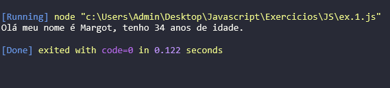
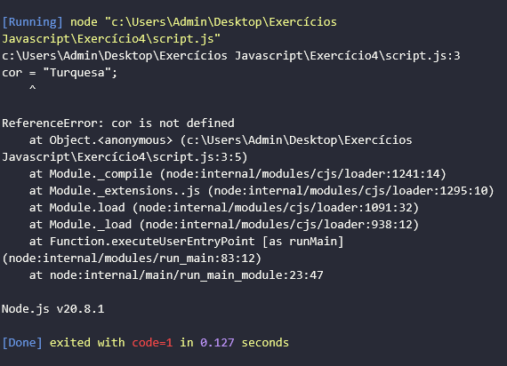
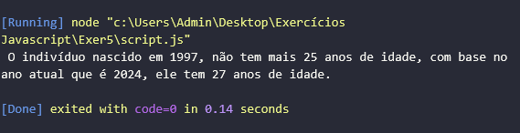
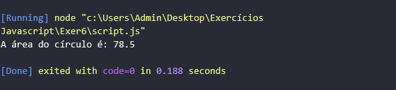
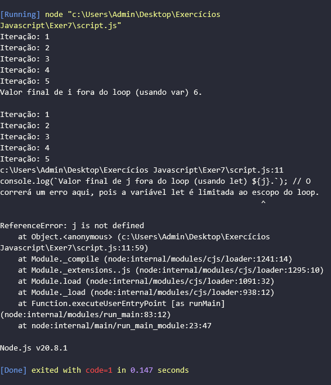
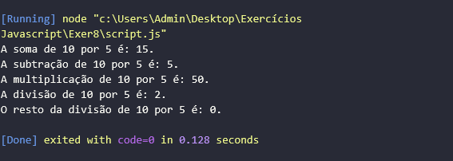
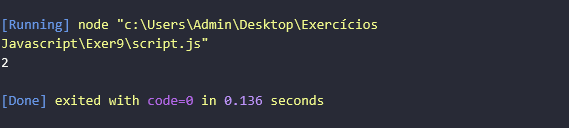
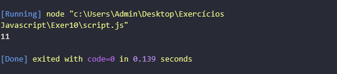

# EXERCÍCIOS JAVASCRIPT

## ÍNDICE

1. [COMENTÁRIOS](README.md#1-comentários)
2. [MODO ESTRITO](README.md#2-modo-estrito)
3. [TIPOS DE VARIÁVEIS](README.md#3-tipos-de-variáveis)
4. [OPERADORES MATEMÁTICOS](README.md#4-operadores-matemáticos)

## 1. COMENTÁRIOS {#comentários}

**1.1** Escreva um pequeno programa em JavaScript que declare duas variáveis (por exemplo, nome e idade) e atribua valores a elas. Em seguida, adicione comentários explicativos para cada linha de código, explicando o que cada parte faz.

```javascript
// Declaração e atribuição de valores nas variáveis 'nome' e 'idade'.
let nome = "Margot";
let idade = 34;

// Impressão das informações no console.
console.log("Olá meu nome é " + nome + ", tenho " + idade + " anos de idade.");
```

**Resultado:**



**1.2** Escreva um pequeno programa em JavaScript que declare duas variáveis de sua preferência e atribua valores a elas. Em seguida, adicione comentários explicativos para cada linha de código, explicando o que cada parte faz.

```javascript
// Declaração e atribuição de valores nas variáveis 'nome' e 'sobrenome'.
let nome = "James";
let sobrenome = "Bond";

// Impressão das informações no console usando template string (delimitadas por crases ``).
console.log(`Olá o meu nome é ${nome}, ${nome} ${sobrenome}.`);
```

**Resultado:**


## 2. MODO ESTRITO {#modo-estrito}

**2.1** Declare uma variável chamada x sem usar a palavra-chave var, let ou const. Execute o código em Modo Estrito e observe o que acontece.

```javascript
"use strict";

x = 10;
console.log(x);
```

**Resultado:**


**2.2** Atribua um valor a uma variável não declarada (por exemplo, y = 10;). Execute o código em Modo Estrito e observe o que acontece.

```javascript
"use strict";

cor = "Turquesa";
console.log(cor);
```

**Resultado:**



## 3. TIPOS DE VARIÁVEIS {#tipos-de-variáveis}

**3.1** Declare uma variável chamada idade usando var e atribua a ela o valor 25. Declare outra variável chamada anoNascimento usando let e atribua a ela o valor 1997. Imprima no console a diferença entre anoNascimento e o ano atual.

```javascript
var idade = 25;
let anoNascimento = 1997;
let anoAtual = 2024;

let diferencaIdade = anoAtual - anoNascimento;

console.log(` O indivíduo nascido em ${anoNascimento}, não tem mais ${idade} anos de idade, com base no ano atual que é ${anoAtual}, ele tem ${diferencaIdade} anos de idade.`);
```

**Resultado:**



**3.2** Declare uma constante chamada PI e atribua a ela o valor 3.14. Declare uma variável chamada raio usando let e atribua a ela um valor qualquer. Calcule a área de um círculo utilizando a fórmula Área = PI * raio * raio e imprima o resultado no console.

```javascript
const PI = 3.14;
let raio = 5;
let areaDoCirculo = PI * raio * raio;

console.log("A área do círculo é:", areaDoCirculo);
```

**Resultado:**



**3.3** Utilize um loop for para iterar de 1 a 5. Declare uma variável chamada contador dentro do loop usando var e imprima o valor de contador a cada iteração. Faça o mesmo, mas desta vez, declare a variável contador usando let e observe a diferença no escopo.

```javascript
for (var i = 1; i <= 5; i++) {
    console.log("Iteração: " + i);
};

console.log(`Valor final de i fora do loop (usando var) ${i}.\n`);

for (let j = 1; j <= 5; j++) {
    console.log("Iteração: " + j);
};

console.log(`Valor final de j fora do loop (usando let) ${j}.`); // O correrá um erro aqui, pois a variável let é limitada ao escopo do loop.
```

**Resultado:**



## 4. OPERADORES MATEMÁTICOS {#operadores-matemáticos}

**4.1** Declare duas variáveis, num1 e num2, e atribua a elas valores numéricos diferentes. Realize as operações de adição, subtração, multiplicação e divisão e resto da divisão entre essas duas variáveis. Imprima os resultados no console.

```javascript
let num1 = 10;
let num2 = 5;

let soma = num1 + num2;
console.log(`A soma de ${num1} por ${num2} é: ${soma}.`);

let subtracao = num1 - num2;
console.log(`A subtração de ${num1} por ${num2} é: ${subtracao}.`);

let multiplicacao = num1 * num2;
console.log(`A multiplicação de ${num1} por ${num2} é: ${multiplicacao}.`);

let divisao = num1 / num2;
console.log(`A divisão de ${num1} por ${num2} é: ${divisao}.`);

let restoDivisao = num1 % num2;
console.log(`O resto da divisão de ${num1} por ${num2} é: ${restoDivisao}.`);
```

**Resultado:**



**4.2** Declare uma variável número e atribua a ela um valor numérico. Utilize o operador de módulo (%) para encontrar o resto da divisão desse número por 3. Imprima o resultado no console.

```javascript
let numero = 1958;
let res = 0;

res = numero % 3;
console.log(res);
```

**Resultado:**



**4.3** Declare uma variável contador e atribua a ela um valor numérico. Utilize os operadores de incremento (++) e decremento (--) para modificar o valor da variável. Imprima os resultados no console.

```javascript
let contador = 10;
contador++;

console.log(contador);
```

**Resultado:**

