# EXERCÍCIOS JAVASCRIPT

## ÍNDICE

1. [COMENTÁRIOS](README.md#1-comentários)
2. [MODO ESTRITO](README.md#2-modo-estrito)
3. [TIPOS DE VARIÁVEIS](README.md#3-tipos-de-variáveis)
4. [OPERADORES MATEMÁTICOS](README.md#4-operadores-matemáticos)
5. [OPERADORES RELACIONAIS](README.md#5-operadores-relacionais)
6. [PROMPT](README.md#6-prompt)
7. [OPERADORES LÓGICOS](README.md#7-operadores-lógicos)
8. [OPERADOR BITWISE](README.md#8-operador-bitwise)
9. [OPERAÇÕES PRÉ-INCREMENTO E PÓS-INCREMENTO](README.md#9-operações-pré-incremento-e-pós-incremento)
10. [OPERADOR TERNÁRIO](README.md#10-operador-ternário)
11. [OPERADOR TYPEOF](README.md#11-operador-typeof)
12. [OPERADOR SPREAD](README.md#12-operador-spread)

## 1. COMENTÁRIOS

**1.1** Escreva um pequeno programa em JavaScript que declare duas variáveis (por exemplo, nome e idade) e atribua valores a elas. Em seguida, adicione comentários explicativos para cada linha de código, explicando o que cada parte faz.

```javascript
// Declaração e atribuição de valores nas variáveis 'nome' e 'idade'.
let nome = "Margot";
let idade = 34;

// Impressão das informações no console.
console.log("Olá meu nome é " + nome + ", tenho " + idade + " anos de idade.");
```

**Resultado:**


**1.2** Escreva um pequeno programa em JavaScript que declare duas variáveis de sua preferência e atribua valores a elas. Em seguida, adicione comentários explicativos para cada linha de código, explicando o que cada parte faz.

```javascript
// Declaração e atribuição de valores nas variáveis 'nome' e 'sobrenome'.
let nome = "James";
let sobrenome = "Bond";

// Impressão das informações no console usando template string (delimitadas por crases ``).
console.log(`Olá o meu nome é ${nome}, ${nome} ${sobrenome}.`);
```

**Resultado:**


## 2. MODO ESTRITO

**2.1** Declare uma variável chamada x sem usar a palavra-chave var, let ou const. Execute o código em Modo Estrito e observe o que acontece.

```javascript
"use strict";

x = 10;
console.log(x);
```

**Resultado:**


**2.2** Atribua um valor a uma variável não declarada (por exemplo, y = 10;). Execute o código em Modo Estrito e observe o que acontece.

```javascript
"use strict";

cor = "Turquesa";
console.log(cor);
```

**Resultado:**


## 3. TIPOS DE VARIÁVEIS

**3.1** Declare uma variável chamada idade usando var e atribua a ela o valor 25. Declare outra variável chamada anoNascimento usando let e atribua a ela o valor 1997. Imprima no console a diferença entre anoNascimento e o ano atual.

```javascript
var idade = 25;
let anoNascimento = 1997;
let anoAtual = 2024;

let diferencaIdade = anoAtual - anoNascimento;

console.log(` O indivíduo nascido em ${anoNascimento}, não tem mais ${idade} anos de idade, com base no ano atual que é ${anoAtual}, ele tem ${diferencaIdade} anos de idade.`);
```

**Resultado:**


**3.2** Declare uma constante chamada PI e atribua a ela o valor 3.14. Declare uma variável chamada raio usando let e atribua a ela um valor qualquer. Calcule a área de um círculo utilizando a fórmula Área = PI * raio * raio e imprima o resultado no console.

```javascript
const PI = 3.14;
let raio = 5;
let areaDoCirculo = PI * raio * raio;

console.log("A área do círculo é:", areaDoCirculo);
```

**Resultado:**


**3.3** Utilize um loop for para iterar de 1 a 5. Declare uma variável chamada contador dentro do loop usando var e imprima o valor de contador a cada iteração. Faça o mesmo, mas desta vez, declare a variável contador usando let e observe a diferença no escopo.

```javascript
for (var i = 1; i <= 5; i++) {
    console.log("Iteração: " + i);
};

console.log(`Valor final de i fora do loop (usando var) ${i}.\n`);

for (let j = 1; j <= 5; j++) {
    console.log("Iteração: " + j);
};

console.log(`Valor final de j fora do loop (usando let) ${j}.`); // O correrá um erro aqui, pois a variável let é limitada ao escopo do loop.
```

**Resultado:**


## 4. OPERADORES MATEMÁTICOS

**4.1** Declare duas variáveis, num1 e num2, e atribua a elas valores numéricos diferentes. Realize as operações de adição, subtração, multiplicação e divisão e resto da divisão entre essas duas variáveis. Imprima os resultados no console.

```javascript
let num1 = 10;
let num2 = 5;

let soma = num1 + num2;
console.log(`A soma de ${num1} por ${num2} é: ${soma}.`);

let subtracao = num1 - num2;
console.log(`A subtração de ${num1} por ${num2} é: ${subtracao}.`);

let multiplicacao = num1 * num2;
console.log(`A multiplicação de ${num1} por ${num2} é: ${multiplicacao}.`);

let divisao = num1 / num2;
console.log(`A divisão de ${num1} por ${num2} é: ${divisao}.`);

let restoDivisao = num1 % num2;
console.log(`O resto da divisão de ${num1} por ${num2} é: ${restoDivisao}.`);
```

**Resultado:**


**4.2** Declare uma variável número e atribua a ela um valor numérico. Utilize o operador de módulo (%) para encontrar o resto da divisão desse número por 3. Imprima o resultado no console.

```javascript
let numero = 1958;
let res = 0;

res = numero % 3;
console.log(res);
```

**Resultado:**


**4.3** Declare uma variável contador e atribua a ela um valor numérico. Utilize os operadores de incremento (++) e decremento (--) para modificar o valor da variável. Imprima os resultados no console.

```javascript
let contador = 10;
contador++;

console.log(contador);
```

**Resultado:**


## 5. OPERADORES RELACIONAIS

**5.1** Declare duas variáveis, por exemplo, a e b, e atribua valores numéricos a elas. Use os operadores relacionais para verificar se a é maior que b. Imprima o resultado no console.

```javascript
let a = 10, b = 27;

let res = (a > b);

console.log(res);
```

**Resultado:**

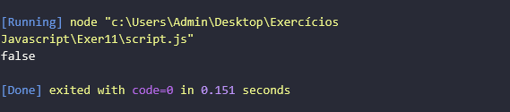

**5.2** Declare duas variáveis de string, por exemplo, str1 e str2, e atribua valores a elas. Use os operadores relacionais para verificar se str1 é igual a str2. Imprima o resultado no console.

```javascript
let str1 = "Comida", str2 = "Comida";

console.log(str1 === str2);
```

**Resultado:**

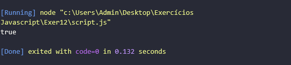

**5.3** Declare uma variável numérica e outra variável de string. Use os operadores relacionais para verificar se os valores são iguais, sem considerar o tipo. Imprima o resultado no console.

```javascript
let valor1 = 15, valor2 = "15";

res = valor1 == valor2;

// A resposta só será true, pois o Javascript não leva em consideração o tipo de variável (Number, String, Boolean...). Para dar false é necessário usar o operador de igualdade estrita(`===`).
console.log(res);
```

**Resultado:**


## 6. PROMPT

**6.1** Utilize o prompt para solicitar ao usuário que insira seu nome. Armazene o nome em uma variável. Exiba uma mensagem de saudação no console, utilizando o nome fornecido.

```javascript
let nome = prompt("Digite o seu nome.");

console.log(`Olá, ${nome}!`);
```

**Resultado:**

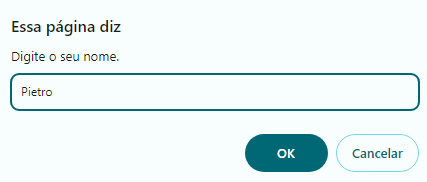
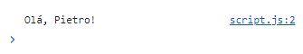

**6.2** Utilize o prompt para solicitar ao usuário que insira sua idade. Armazene a idade em uma variável. Calcule o ano de nascimento com base na idade fornecida. Exiba uma mensagem no console informando o ano de nascimento.

```javascript
let idade = prompt("Digite a sua idade.");

let data = new Date();
let anoNascimento = data.getFullYear() - idade;

console.log(`%cVocê nasceu em ${anoNascimento}.`, 'color: #ff0099');
```

**Resultado:**

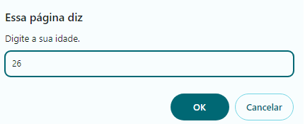
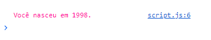

**6.3** Utilize o prompt para solicitar ao usuário que insira dois números. Armazene os números em variáveis. Realize operações simples (por exemplo, adição, subtração, multiplicação) com esses números. Exiba os resultados no console.

```javascript
let v1 = prompt("Digite o 1º número:");
let v2 = prompt("Digite o 2º número:");

// O prompt retorna strings, logo é necessário a conversão dos valores para numbers.
v1 = parseFloat(v1);
v2 = parseFloat(v2);

let soma = v1 + v2;
console.log(`%cA soma de ${v1} + ${v2} é: ${soma}.`, 'color: #3300ff');

let subtracao = v1 - v2;
console.log(`%cA subtração de ${v1} - ${v2} é: ${subtracao}.`, 'color: #ff0000');

let multiplicacao = v1 * v2;
console.log(`%cA multiplicação de ${v1} * ${v2} é: ${multiplicacao}.`, 'color: #800080');
```

**Resultado:**

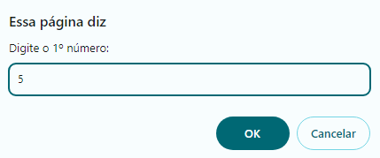
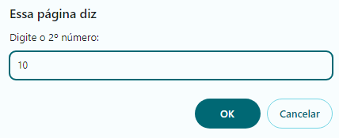
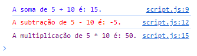

## 7. OPERADORES LÓGICOS

**7.1** Declare duas variáveis booleanas, por exemplo, temSol e temChuva. Crie uma condição utilizando operadores lógicos (&&, ||, !) que determine se é um bom dia para sair. Por exemplo, pode ser um bom dia se tiver sol e não estiver chovendo.

```javascript
let temSol = true;
let temChuva = false;

let clima = "ensolarado";

if (clima === "ensolarado" && !temChuva) {
    console.log("%cÉ um bom dia para sair.", 'color: #ffffff; background-color: #9999ff');
} else {
    console.log("%cNão é um bom dia para sair!", 'color: #ffffff; background-color: #ff0000');
}
```

**Resultado:**

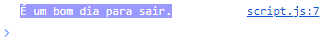

**7.2** Declare uma variável idade e atribua um valor numérico a ela. Crie uma condição utilizando operadores lógicos para verificar se a pessoa é elegível para votar (por exemplo, se a idade é maior ou igual a 18).

```javascript
let idade = 18;

if (idade === 16 || idade === 17) {
    console.log("%cVocê já está apto a votar.", 'color: #ffffff; background-color: #0000ff');
} else if (idade <= 15) {
    console.log("%cVocê ainda não pode votar.", 'color: #ffffff; background-color: #ff0000');
} else if (idade < 70) {
    console.log("%cVocê tem a obrigação de votar.", 'color: #000000; background-color: #ffa500');
} else {
    console.log("%cVocê não tem mais a obrigação de votar.", 'color: #000000; background-color: #00ffa5');
}
```

**Resultado:**

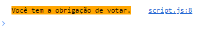

**7.3** Declare uma variável senha e atribua uma string a ela. Crie uma condição utilizando operadores lógicos para verificar se a senha atende a alguns critérios, como ter pelo menos 8 caracteres e conter pelo menos um número.

```javascript
const senha = "jt W3k7oC*";

if (
    /[A-Z]/.test(senha) &&
    /[!@#$%^&*()_+{}\[\]:;<>,.?~\\\/\-]/.test(senha) &&
    senha.length >= 8
) {
    console.log("%cAcesso concedido, seja bem-vindo!", 'color: #005aff');
} else {
    console.log("%cAcesso negado!", 'color: #ff2500');
}
```

**Resultado:**

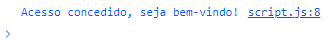

## 8. OPERADOR BITWISE

**8.1** Declare duas variáveis inteiras, por exemplo, a e b. Atribua valores a essas variáveis. Use o operador bitwise AND (&) para realizar a operação bitwise entre esses números. Imprima o resultado.

```javascript
let a = 5; //  0101.
let b = 15; // 1111.
let res = a & b;

console.log(`Operação AND Bitwise: ${res}`); // 5: 0101.
```

**Resultado:**

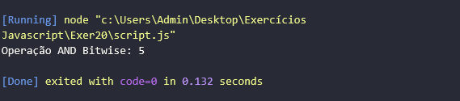

**8.2** Declare duas variáveis inteiras, por exemplo, c e d. Atribua valores a essas variáveis. Use o operador bitwise OR (|) para realizar a operação bitwise entre esses números. Imprima o resultado.

```javascript
let c = 27; //  11011.
let d = 33; // 100001.

console.log("Operação | Bitwise: " + (c | d)); // 59: 111011.
```

**Resultado:**

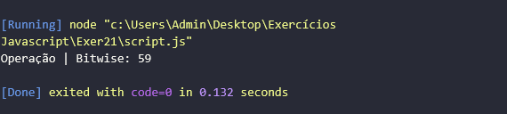

**8.3** Declare uma variável inteira, por exemplo, e. Atribua um valor a essa variável. Use o operador de shift para a esquerda (<<) para deslocar os bits para a esquerda. Imprima o resultado.

```javascript
let e = 1980; // 11111000100.

console.log("Operação << Bitwise: " + (e << 2) + "."); // 7920: 1111100010000.
```

**Resultado:**

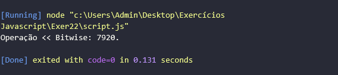

## 9. OPERAÇÕES PRÉ-INCREMENTO E PÓS-INCREMENTO

**9.1** Declare uma variável a e atribua a ela o valor 5. Utilize o operador de pré-incremento para incrementar o valor de a. Imprima o valor atual de a no console.

```javascript
let a = 5;
++a;

console.log("O valor de a após o pré-incremento é:", a); // 6.
```

**Resultado:**

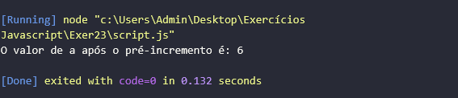

**9.2** Declare uma variável b e atribua a ela o valor 8. Utilize o operador de pós-incremento para incrementar o valor de b. Imprima o valor original e o novo valor de b no console.

```javascript
let b = 8;

console.log("Valor de b antes do pós-incremento:", b++);

console.log("Valor de b após o pós-incremento:", b);
```

**Resultado:**

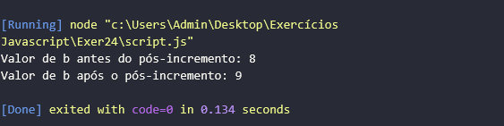

**9.3** Declare uma variável c e atribua a ela o valor 9. Utilize o operador de pré-incremento duas vezes consecutivas em c. Em seguida, utilize o operador de pós-incremento em c. Imprima o valor final de c no console.

```javascript
let c = 9;

console.log(`Valor original de c: ${c}.`); // 9.

++c;
++c;
console.log(`Valor de c após ser pré-incrementado duas vezes consecutivas: ${c}`); // 11.

c++;
console.log(`Valor final de c, após o pós-incremento: ${c}.`); // 12.
```

**Resultado:**

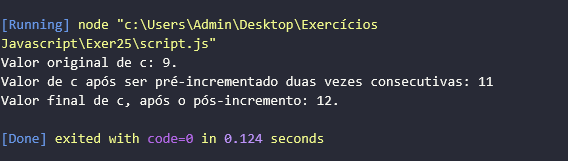

## 10. OPERADOR TERNÁRIO

**10.1** Declare uma variável chamada numero e atribua um número a ela. Use o operador ternário para verificar se o número é par ou ímpar. Imprima no console uma mensagem indicando se o número é par ou ímpar.

```javascript
let numero = 2;
let resultado = (numero % 2 == 0) ? "Par" : "Ímpar";

console.log(`O número ${numero} é ${resultado}.`);
```

**Resultado:**

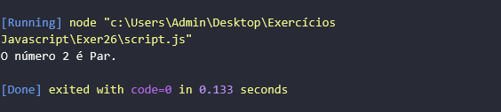

**10.2** Declare uma variável chamada idade e atribua um valor a ela. Utilize o operador ternário para verificar se a pessoa é maior de idade (idade >= 18). Imprima no console uma mensagem indicando se a pessoa é maior de idade ou não.

```javascript
let idade = 33;

let res = idade >= 18 ? "maior de idade" : "menor de idade";

console.log(`Você tem ${idade} anos de idade, portanto você é ${res}.`);
```

**Resultado:**

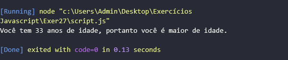

**10.3** Declare duas variáveis: gênero (pode ser "Masculino" ou "Feminino") e idade. Use o operador ternário para criar uma mensagem de saudação personalizada com base no gênero e idade. Imprima a mensagem no console.

```javascript
let genero = "Masculino";
let idade = 27;

let mensagem = (genero === "Feminino") ? "Olá Senhora!" : "Olá Senhor!";
mensagem += (idade >= 18) ? " Você é uma pessoa adulta." : " Você é menor de idade.";

console.log(`${mensagem}`);
```

**Resultado:**

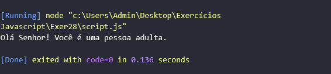

## 11. OPERADOR TYPEOF

**11.1** Declare uma variável chamada numero e atribua a ela um número inteiro. Use o operador typeof para verificar e imprimir o tipo de dado da variável numero.

```javascript
let numero = 15;

console.log(typeof (numero));
```

**Resultado:**

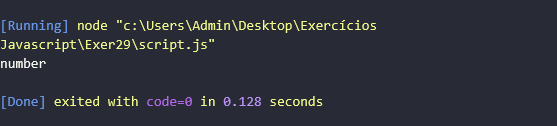

**11.2** Declare uma variável chamada texto e atribua a ela uma string. Use o operador typeof para verificar e imprimir o tipo de dado da variável texto.

```javascript
let texto = "Sol";

console.log("Valor: " + texto + " - Tipo: " + typeof (texto));
```

**Resultado:**

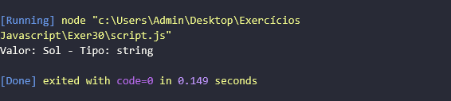

**11.3** Declare uma variável chamada verdadeiroFalso e atribua a ela um valor booleano (true ou false). Use o operador typeof para verificar e imprimir o tipo de dado da variável verdadeiroFalso.

```javascript
let verdadeiroFalso = true;

console.log("Valor: " + verdadeiroFalso + " - Tipo: " + typeof (verdadeiroFalso));
```

**Resultado:**

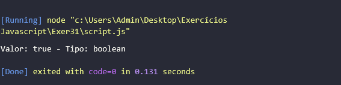

## 12. OPERADOR SPREAD

**12.1** Crie um array chamado arrayOriginal com alguns elementos. Use o operador spread para criar uma cópia desse array chamada copiaArray. Modifique um elemento no copiaArray e veja se isso afeta o arrayOriginal.

```javascript
let arrayOriginal = ["Laranja", "Limão", "Abacaxi", "Ameixa", "Uva", "Manga"];
let copiaArray = [...arrayOriginal];

copiaArray[3] = "Morango";

console.log("Itens do Array Original: ", arrayOriginal);
console.log("Cópia do Array Original: ", copiaArray);
```

**Resultado:**

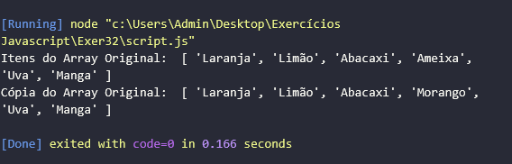