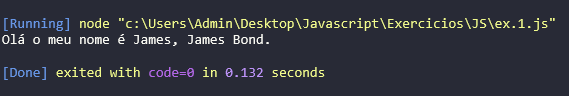

# EXERCÍCIOS JAVASCRIPT

## 1. COMENTÁRIOS

**1.1** Escreva um pequeno programa em JavaScript que declare duas variáveis (por exemplo, nome e idade) e atribua valores a elas. Em seguida, adicione comentários explicativos para cada linha de código, explicando o que cada parte faz.

```javascript
// Declaração e atribuição de valores nas variáveis 'nome' e 'idade'.
let nome = "Margot";
let idade = 34;

// Impressão das informações no console.
console.log("Olá meu nome é " + nome + ", tenho " + idade + " anos de idade.");
```

**Resultado:**


**1.2** Escreva um pequeno programa em JavaScript que declare duas variáveis de sua preferência e atribua valores a elas. Em seguida, adicione comentários explicativos para cada linha de código, explicando o que cada parte faz.

```javascript
// Declaração e atribuição de valores nas variáveis 'nome' e 'sobrenome'.
let nome = "James";
let sobrenome = "Bond";

// Impressão das informações no console usando template string (delimitadas por crases ``).
console.log(`Olá o meu nome é ${nome}, ${nome} ${sobrenome}.`);
```

**Resultado:**



**1.3** Declare uma variável chamada x sem usar a palavra-chave var, let ou const. Execute o código em Modo Estrito e observe o que acontece.

```javascript
"use strict";

x = 10;
console.log(x);
```

**Resultado:**

